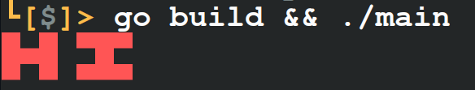

# ⚠️ DEPRECATED ⚠️

This package is severely broken and horribly slow. I will probably design a new package differently named that is not completely down syndromed.

---

# Canvas [](https://github.com/notwithering/canvas/blob/master/LICENSE)

**Canvas** is a simple go package that provides functions to help you create and display canvases in the terminal.

### Contents

- [Example](#example)

## Example



```go
package main

import (
	"fmt"
	"image/color"

	"github.com/notwithering/canvas"
)

func main() {
	myCanvas := canvas.New(7, 3)
	myCanvas = canvas.Fill(myCanvas, color.Transparent)

	myCanvas[0][0] = color.RGBA{255, 85, 85, 255}
	myCanvas[0][1] = color.RGBA{255, 85, 85, 255}
	myCanvas[0][2] = color.RGBA{255, 85, 85, 255}
	myCanvas[1][1] = color.RGBA{255, 85, 85, 255}
	myCanvas[2][0] = color.RGBA{255, 85, 85, 255}
	myCanvas[2][1] = color.RGBA{255, 85, 85, 255}
	myCanvas[2][2] = color.RGBA{255, 85, 85, 255}

	myCanvas[4][0] = color.RGBA{255, 85, 85, 255}
	myCanvas[5][0] = color.RGBA{255, 85, 85, 255}
	myCanvas[6][0] = color.RGBA{255, 85, 85, 255}
	myCanvas[5][1] = color.RGBA{255, 85, 85, 255}
	myCanvas[4][2] = color.RGBA{255, 85, 85, 255}
	myCanvas[5][2] = color.RGBA{255, 85, 85, 255}
	myCanvas[6][2] = color.RGBA{255, 85, 85, 255}

	me := canvas.Text(myCanvas)
	fmt.Println(me)
}

```
